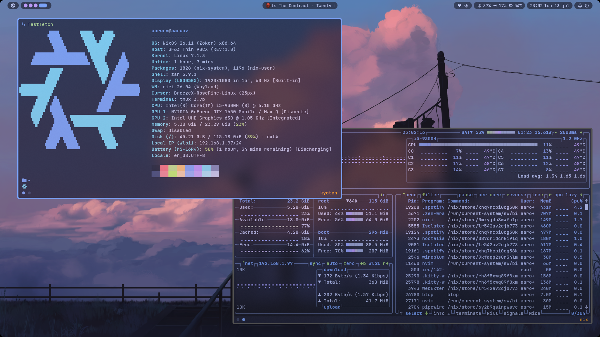

# Nixos Configurations



Personal NixOS and nix-darwin configuration by [Aaron Vargas](https://github.com/aaron70).


## Features

- **Cross-platform** — shared module system for both NixOS and macOS via nix-darwin
- **Three-tier architecture** — profiles (who you are) → features (capabilities) → programs (tools)
- **Wrapper module system** — programs ship with auto-generated configs via `nix-wrapper-modules`
- **Tokyo Night theme** — consistent look across shell prompt (oh-my-posh), WM (niri), terminal (kitty), and desktop shell (Noctalia)
- **niri + Noctalia** on Linux — scrollable-tiling Wayland compositor with a full-featured desktop shell
- **AeroSpace** on macOS — native tiling window manager
- **GPD Win Max 2** — Steam Deck / handheld optimizations via Jovian-NixOS, fingerprint driver
- **Secrets management** — git-crypt encrypted profiles for credentials

## Hosts

| Host | Arch | OS | Profile | GPU |  Desktop |
|------|------|----|---------|-----|----------|
| `pc` | x86_64 | NixOS | personal | NVIDIA | niri + Noctalia |
| `laptop` | x86_64 | NixOS | personal | Intel | niri + Noctalia |
| `gpd` | x86_64 | NixOS (Jovian) | personal | AMD | niri + Noctalia |
| `mac` | aarch64 | macOS | work | Apple Silicon | AeroSpace |

## Architecture

```
flake.nix  — flake-parts + import-tree
 └── modules/
     ├── configurations/    system-level config (boot, audio, networking, etc.)
     ├── hosts/             machine definitions (hardware + preferences)
     ├── profiles/          user identities (personal, work, vmtest)
     ├── features/          capability toggles (development, gaming)
     ├── programs/          program definitions + wrappers + scripts
     └── wrapperModules/    low-level wrapper templates (kitty, ghostty, oh-my-posh)
```

**Key insight**: Profiles control *who you are* (which features and programs are active), features control *what you can do*, and programs control *what tools you have* — all wired through a shared `preferences` option.

## Quick Start

```sh
# Clone and enter
git clone https://github.com/aaron70/nix && cd nix

# Unlock encrypted profiles (if you have the key)
git-crypt unlock /path/to/key

# Build and switch for a specific host (NixOS)
sudo nixos-rebuild switch --flake .#pc

# Or using nh (recommended)
nh os switch --host pc .

# For macOS
darwin-rebuild switch --flake .#mac

# Update flake inputs
nix flake update

# Clean old generations
nh clean all --keep 3
```

## Security

### Git Crypt

To keep some sensitive files protected, **git-crypt** is used to encrypt and decrypt the files.

[git-crypt](https://github.com/AGWA/git-crypt) transparently encrypts and decrypts files when pushed or checked out.

```sh
# Export the private key
git-crypt export-key /path/to/key

# Unlock encrypted files with the exported key
git-crypt unlock /path/to/key

# Encrypt the files again
git-crypt lock
```

## Maintenance

### Update Noctalia Plugins

Get the commit hash from the latest commit on the [Plugins Repository](https://github.com/noctalia-dev/noctalia-plugins/commits/main) and replace it on the `fetchgit` function, then use `sha256-AAAAAAAAAAAAAAAAAAAAAAAAAAAAAAAAAAAAAAAAAAA=` as the **sha256** and run the configuration — it will fail and give you the real **sha256**.

## Troubleshooting

### No audio on headsets

Open `pavucontrol` or `Bluetooth Manager` and change the audio profile. Currently works with `High Fidelity Playback (A2DP Sink, codec AAC)`.

### Setup the monitors position

`wdisplays` is installed for setting up monitor positions. Set the positions within the application and then copy the values into the niri configuration.

### Git Credentials broken

If NixOS rebuilds `gh`, the git credentials configuration might break since it may still point to the old `gh` path.
To fix it, run `gh auth setup-git`.
