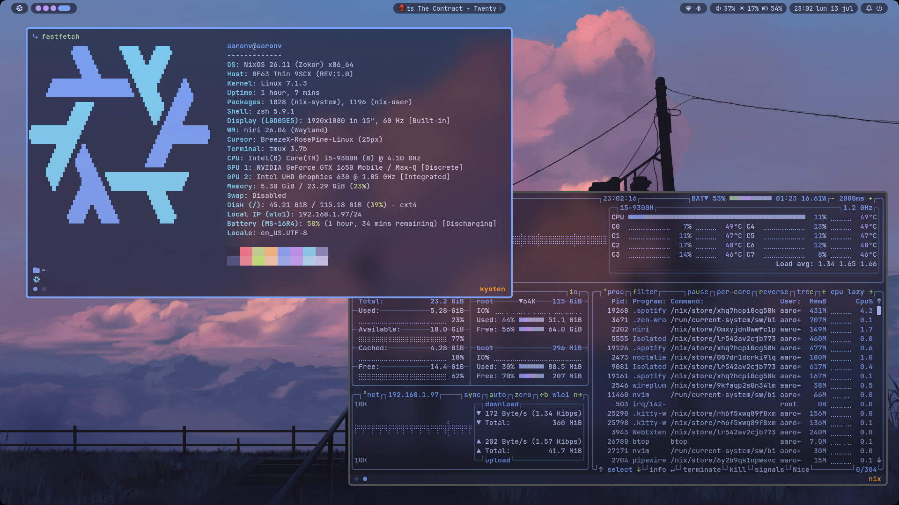

# Nixos Configurations



Personal NixOS and nix-darwin configuration by [Aaron Vargas](https://github.com/aaron70).

## Hosts

| Host | Arch | OS | User | GPU | Desktop | Notes |
|------|------|----|---------|-----|----------|-----|
| `pc` | x86_64 | NixOS | aaronv | NVIDIA | niri + Noctalia | Personal computer, for gaming and development. |
| `laptop` | x86_64 | NixOS | aaronv | Intel | niri + Noctalia | Personal laptop, for development. |
| `gpd` | x86_64 | NixOS (Jovian) | aaronv | AMD | niri + Noctalia | Handheld console, for gaming and occasionally development. |
| `mac` | aarch64 | macOS | aaronvargas | Apple Silicon | AeroSpace | Work computer. (Not implemented yet) |


## Architecture

The flake is wired with `flake-parts` + `import-tree`. The framework lives in `anvil/`, the concrete configuration lives in `modules/` (each subdirectory is auto-imported as a flake module).

```
flake.nix
├── anvil/                  The framework, as glue code for nixos, home and darwin modules
│   ├── declarations/       Option schemas of the framework's entities 
│   ├── lib/                Helper Functions 
│   └── options/            The anvil namespace where the entities are defined: anvil.hosts / anvil.users / anvil.features / anvil.programs
└── modules/                My nixos configuration modules
    ├── hosts/
    ├── users/
    ├── features/
    ├── programs/
    ├── declarations/       shared option schemas
    ├── dotfiles/           config templates, scripts and configuration functions
    └── secrets/            sops-encrypted secrets + wiring
```

**Key concepts**

- **Entities** — hosts, users, features and programs. Each has `name`, free-form `metadata`, optional lists of children (`features`, `programs`, `users`) and per-platform fragments `nixos` / `darwin` / `home`.
- **Fragments** — a fragment is a NixOS/nix-darwin/home-manager module merged into every target that enables its entity. Hosts without a fragment just aggregate the fragments of their features/programs/users.
- **Refkeys** — children can be referenced by a plain string (`"gaming"`) or a refkey submodule `{ ref, variant, merge, override }` to select a variant or tweak an entity for a single consumer. Lists (and fragments) can also be *functions* of the context `{ host, user, program, feature }`, so a feature can, for example, read `host.metadata.mainUser`.
- **Generation** — each host's `systems.<platform>` entry (a system string or `{ system = alias; }`) yields an output. `self.lib.mkHosts` collects the host's own fragment plus the fragments of every enabled feature, program and user (deduplicated by `name` / `name@variant`) and builds `nixosConfigurations`, `darwinConfigurations` and `homeConfigurations`.
- **Context injection** — `self.lib.withContext ctx` injects the entity context into fragments, so configs stay generic and adapt to who's running them.
- **Wrappers & dotfiles** — `self.wrappers.<name>.wrap` produces a configured package from `nix-wrapper-modules`; `self.dotfiles.<name>.default` returns the config text used by those wrappers (and home-manager). The shared theme comes from `self.lib.getColors`.

The split mirrors intent: **host/user** define *who you are*, **features** what *you can do*, **programs** what *tools you have*.

## Quick Start

> Note: `.envrc` (direnv) ships with the repo but the flake currently defines no `devShell`, so `direnv allow` has no effect for now.

The shell installs host-specific aliases (baked for the host you're on, pointing at `host.metadata.nixPath`):

| Alias | Runs |
|-------|------|
| `nswitch` | `nh os switch <nixPath> -H <this-host>` |
| `ntest` | `nh os test <nixPath> -H <this-host>` |
| `nboot` | `nh os boot <nixPath> -H <this-host>` |
| `nbuild-vm` | `nh os build-vm <nixPath> -H <this-host>` |
| `nclean` | `nh clean all --optimise -k <configurationLimit>` |
| `nshell` | `nix-shell --command <shell> -p` |

Manually (e.g. from a machine without the aliases):

```sh
# Rebuild and switch (daily driver)
sudo nixos-rebuild switch --flake .#pc       # pc | laptop | gpd
darwin-rebuild switch --flake .#mac          # once implemented

# Update inputs
nix flake update                             # all inputs
nix flake lock --update-input nixpkgs        # a single input

# Format all files (alejandra)
nix fmt
```

## Workflows

**Test a change in a VM**

`nbuild-vm` boots the host in a QEMU VM. It uses `virtualisation.vmVariant`, which forces the password secret off and sets a fixed `initialPassword = "anvil"` (see `modules/users/aaronv.nix`).

**Add a new host**

1. Create `modules/hosts/<name>.nix` declaring `anvil.hosts.<name>` — `systems.nixos`, `users`, `features`, `programs`, `metadata` and the `nixos` fragment — plus a `<name>-hardware` nixosModule.
2. Register the machine's age key in `.sops.yaml` (see [Secrets](#security)).
3. Build: `sudo nixos-rebuild switch --flake .#<name>`.

**Add a feature or program**

- `modules/features/<name>.nix` → `anvil.features.<name>` with `nixos` / `darwin` / `home` fragments; it can pull in programs and other features.
- `modules/programs/<name>.nix` → `anvil.programs.<name>` with `getPackage` and fragments.

Reference it by name (or a refkey) from any entity. The `modules/` import-tree automatically registers it with the flake options.

**Add a user**

Create `modules/users/<name>.nix` → `anvil.users.<name>` with its `nixos` / `darwin` / `home` fragments, then attach it on the host via `users = [...]`.

## Security

### Secrets

Secrets use [sops-nix](https://github.com/Mic92/sops-nix) with age.

- On first activation each host generates its own age keypair at `/path/to/key.txt` (`sops.age.generateKey = true`); `SOPS_AGE_KEY_FILE` points there.
- `.sops.yaml` lists an admin key (`personal_admin`) plus one key per device (`pc`, `laptop`, `gpd`). A device can only *decrypt* (and edit) secrets if its public key appears in that file.
- `modules/secrets/personal.yaml` holds the encrypted secrets (`email`, `password`), wired by the `personal-secrets` feature:
  - `password` → the user's `hashedPasswordFile`.
  - git's `user.name` / `user.email` are rendered through `sops.templates."gitconfig-personal"` (see `modules/programs/git.nix`).
`age` and `sops` are installed on every host and the `sops` feature already exports `SOPS_AGE_KEY_FILE=/path/to/key.txt`, so these commands work out of the box on a managed host. The prefix is only needed when running outside a host that doesn't set it.

**Commands**

```sh
# Edit a secret (opens your $EDITOR on the decrypted file)
SOPS_AGE_KEY_FILE=/path/to/key.txt sops modules/secrets/personal.yaml

# Set a single value (no editor)
SOPS_AGE_KEY_FILE=/path/to/key.txt sops set modules/secrets/personal.yaml '["password"]' '<value>'

# Read/verify without touching the file
SOPS_AGE_KEY_FILE=/path/to/key.txt sops -d modules/secrets/personal.yaml
SOPS_AGE_KEY_FILE=/path/to/key.txt sops -d --extract '["email"]' modules/secrets/personal.yaml

# Give a new device access:
age-keygen -o /tmp/key.txt          # 1. generate a keypair
age-keygen -y /tmp/key.txt          # 2. prints its public key -> age1...
# 3. add `- &<name>  age1...` under `keys:` and `- *<name>` in the
#    creation rule of `.sops.yaml`
SOPS_AGE_KEY_FILE=/path/to/key.txt sops updatekeys modules/secrets/personal.yaml   # 4. re-encrypt with the new recipient set

# Rotate the data key (re-encrypts in place)
SOPS_AGE_KEY_FILE=/path/to/key.txt sops -r -i modules/secrets/personal.yaml
```

If a machine can't decrypt (e.g. git user/email missing), its key likely isn't in `.sops.yaml` yet — see [Troubleshooting](#troubleshooting).

## Troubleshooting

### No git user and email

Git's `user.name` / `user.email` come from the sops-rendered `gitconfig-personal` template. If they're missing, the secrets are not being decrypted — make sure this device's age key is registered in `.sops.yaml` (see [Secrets](#security)) and rebuild.

### No audio on headsets

Open `pavucontrol` or `Bluetooth Manager` and change the audio profile. Currently works with `High Fidelity Playback (A2DP Sink, codec AAC)`.

### Setup the monitors position

`wdisplays` is installed for setting up monitor positions. Set the positions within the application and then copy the values into `anvil.desktop.preferences.monitors` in the host's module (`modules/hosts/<host>.nix`).
